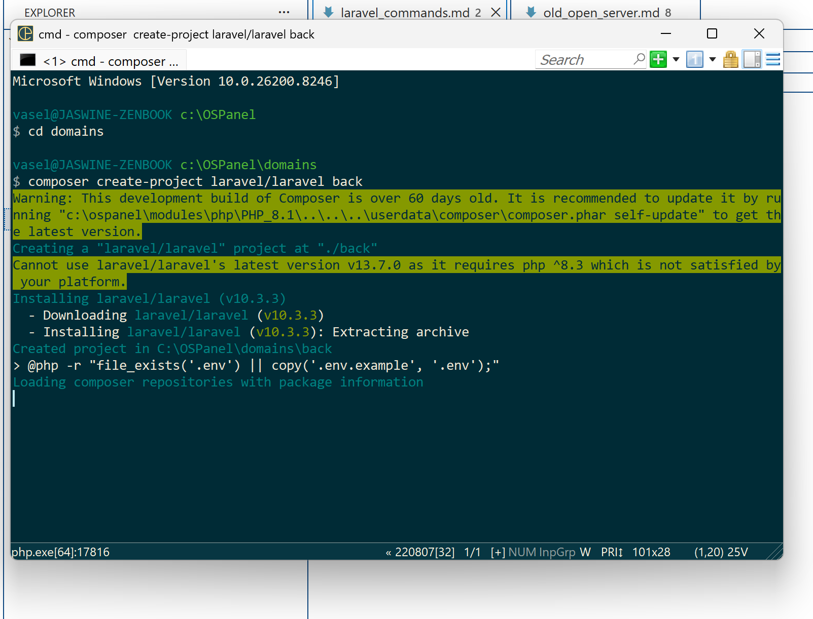
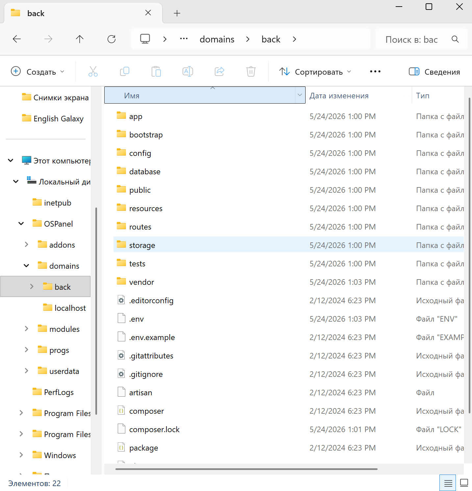
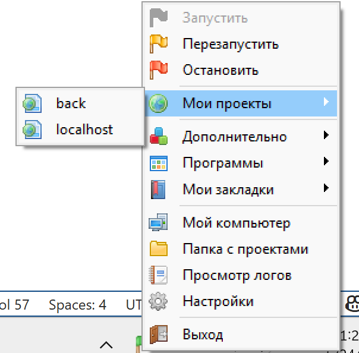
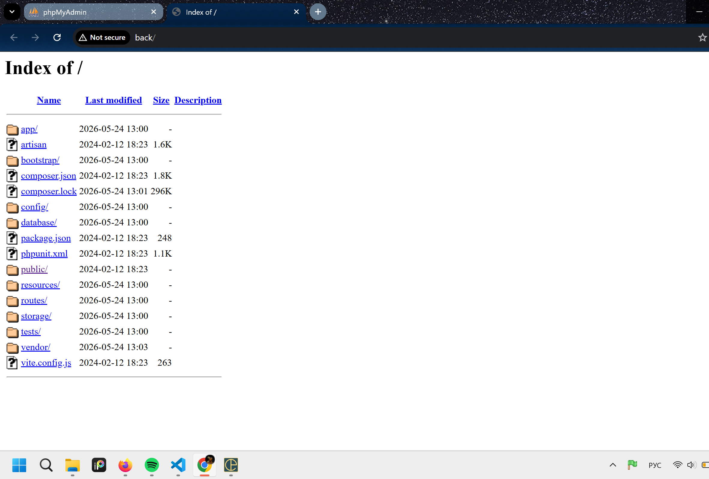
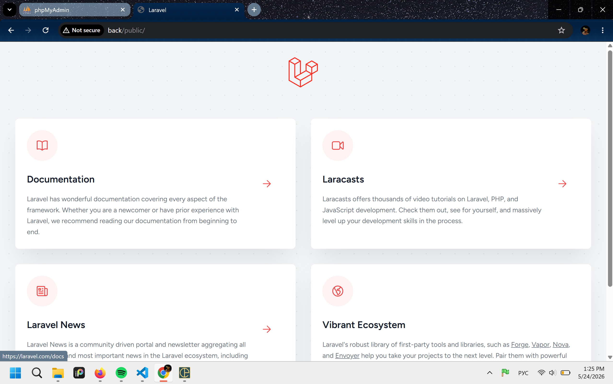
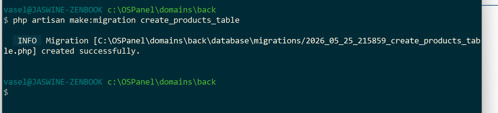

- Создать laravel проект (или перенести в /domains в папку OSPanel)

    Переходим в консоль OpenServer, нажимая на иконку OpenServer -> Дополнительно -> Консоль, переходим в папку domains

    > cd domains

    Создаем laravel проект

    > composer create-project laravel/laravel back

    

    Проверяем что в OSPanel -> domains -> back лежат все базовые laravel папочки

    

    Перезапускаем OpenServer и проверяем наличие проекта back, кликаем на него

    

    Переходим в папку public/

    

    

- Запуск laravel проекта самостоятельно (если нет OpenServer и какой-нибудь XAMPP):

    > composer install 
    > php artisan serve

- Создание файла миграции (database/migrations)

    Для нормальной работы Auth модуля - лучше не удалять таблицу create_users_table, просто изменить ее, другие таблицы можно удалить

    > php artisan make:migration create_some_table

    

- Применение миграций

    Если происходят разные ошибки или хочешь домигрировать какие-то бд, легче почистить бд или удалить и снова все мигрировать

    > php artisan migrate
