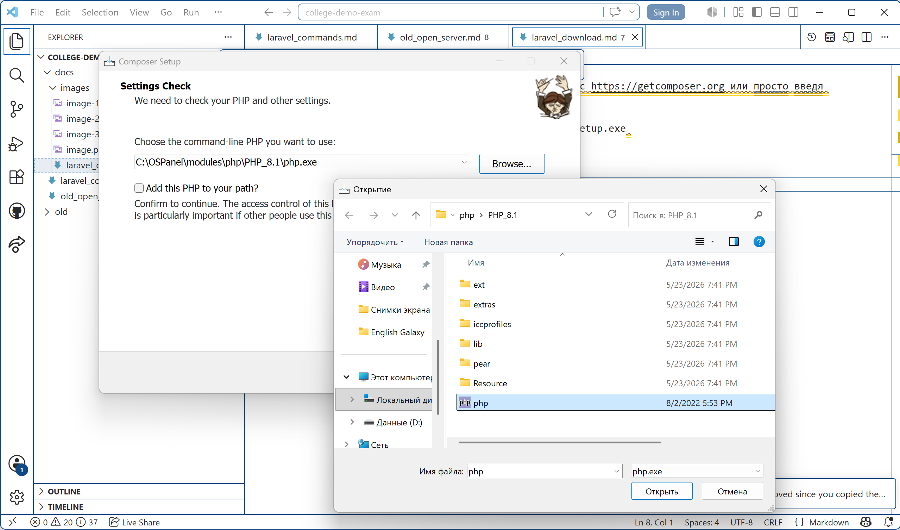

1. Для laravel нужен Composer, его можно скачать с https://getcomposer.org или просто введя "Composer" в google поиске. 

https://getcomposer.org -> Download -> Composer-Setup.exe 

2. Нажимаем на скачанный .exe, кликаем Next, выбираем версию php, кликаем на Browse... и переходим в папку Локальный Диск C: (там где лежит Open Server (OSPanel)) => OSPanel => modules => php => PHP_8.1 => php.exe (нижний файл php с иконкой php); завершаем установку.

