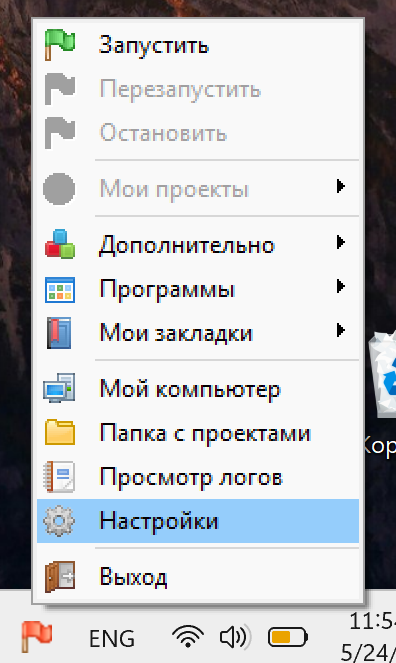
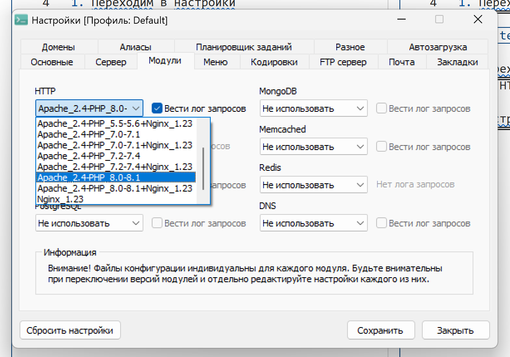
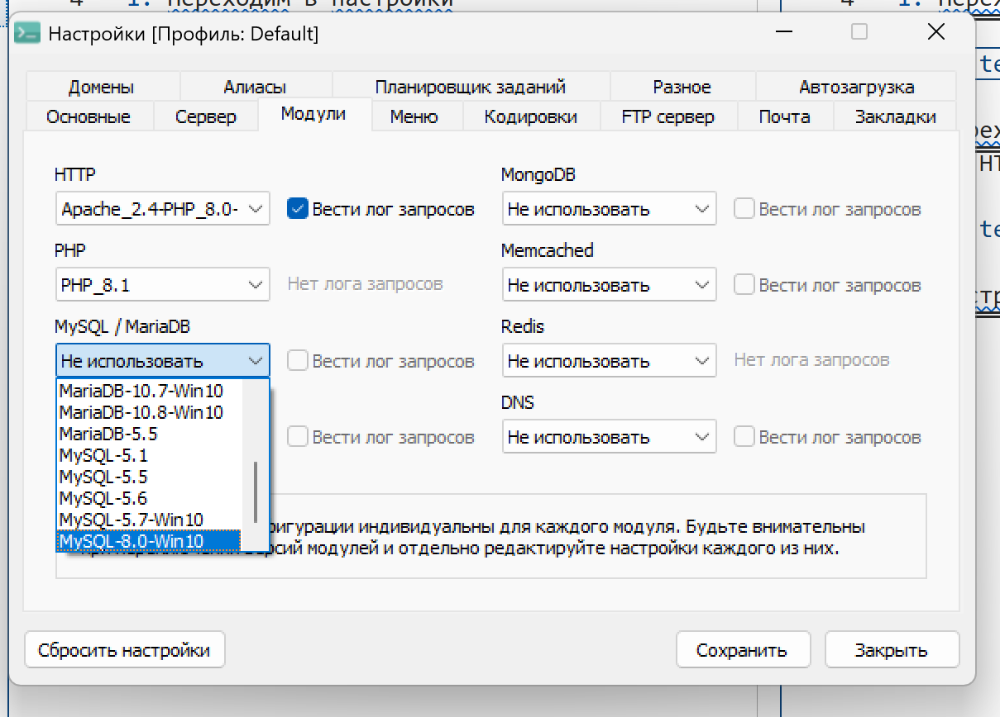
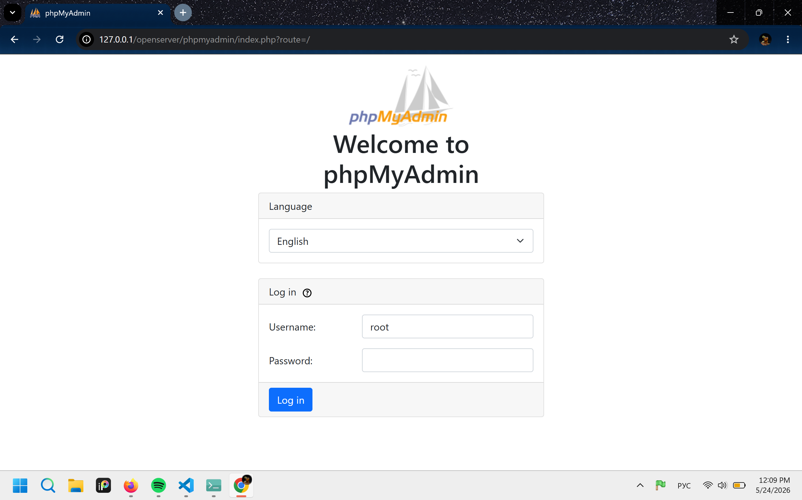

Настройка старого Open Server (v 5.4.x)

1. Переходим в настройки

2. Переходим в Модули и настраиваем версию PHP и HTTP с 7.2 на 8.0-8.1 (без Nginx)

3. Настраиваем MySQL / MariaDB, выбирая последнюю версию MySQL (MySQL-8.0-Win10)

4. Сохраняем, перезапускаем и запускаем

5. Переходим в PhpMyAdmin (Дополнительно -> PhpMyAdmin), вводим в поле Username: root, поле пароля оставляем пустым

