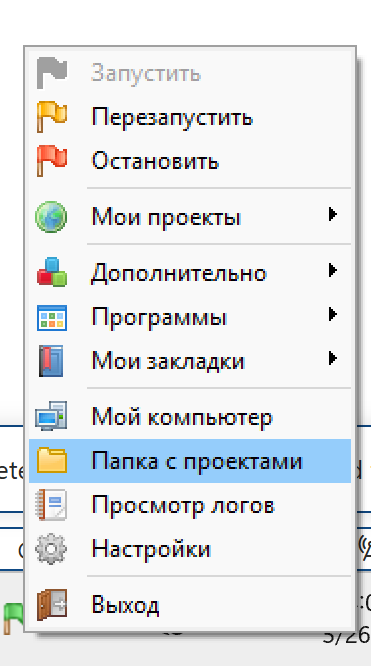
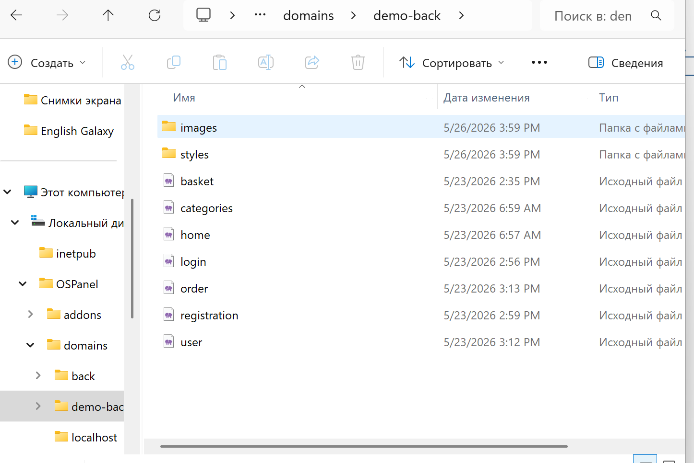
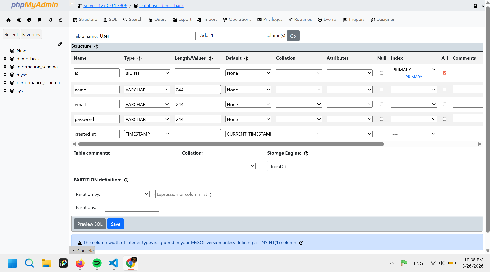
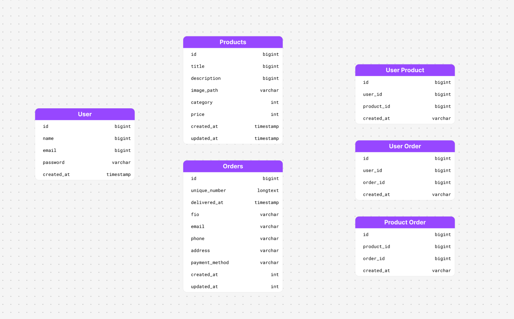

Как создать php проект?

1. Переходим в Папка с проектами в меню Open Server

2. Создаем папку проекта в domains и перекидываем туда все html файлы, переменовываем им окончания с .html на .php

3. Перезапускаем ОпенСервер

Как создать таблицу?

1. Пишем название и количество столбцов

2. Создаем поля, помечаем что ID - PRIMARY и галочку у A I, и CURRENT_TIMESTAMP в колонке Default у created_at / updated_at для автоматической смены даты

Таблицы (с минимальными коллонками):

